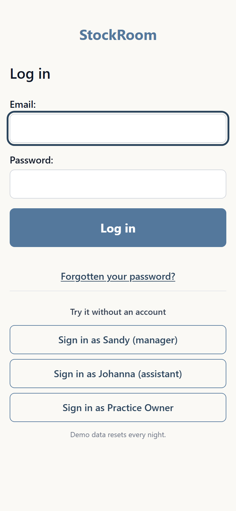
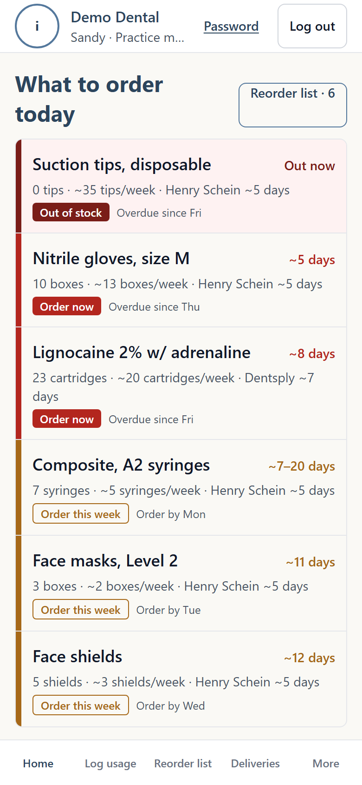
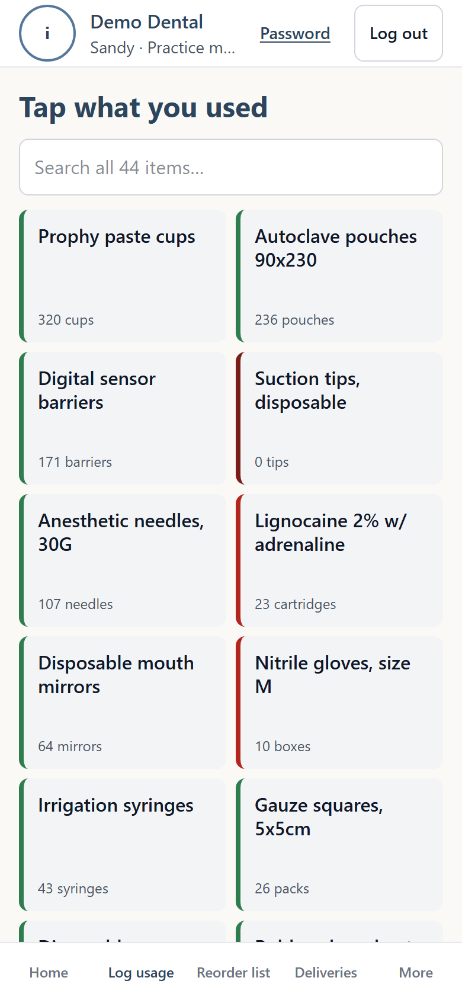
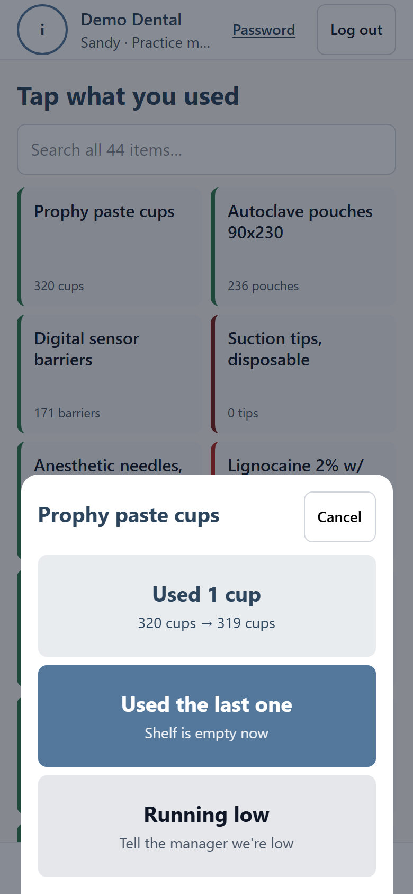
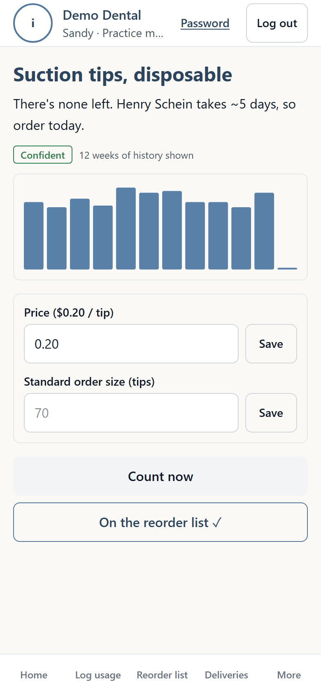
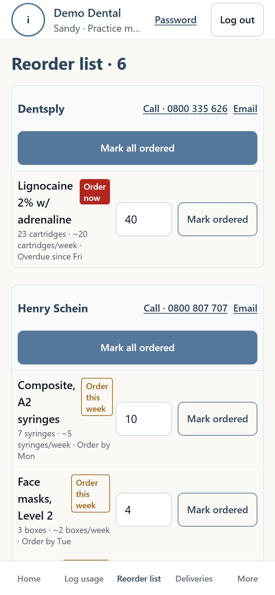

# StockRoom

StockRoom is a stock-ordering PWA for New Zealand dental practices. Instead
of a monthly stocktake, it's kept up to date by whoever's actually using the
supplies, and it tells the practice manager what to order before the shelf
runs empty.

- **Dental assistants** log what they've used in a tap or two, mid-procedure,
  wearing gloves, and can ask for anything else to go on the reorder list.
- **Practice managers and owners** work from one reorder list grouped by
  supplier, add to it or say yes to what the team asked for, call or email
  suppliers, and tick items off once they've ordered.

## Live demo

**[stockroom-production-1adf.up.railway.app](https://stockroom-production-1adf.up.railway.app/)**

The login page has a one-click button into the demo practice, Discover
Dental (or log in with `reception@discoverdental.co.nz` and the password
`password`). Then tap a staff code: Johanna `11` or Liz `22` (dental
assistants, 2 digits then Go), or Sandy `0000` or the Practice Owner `5555`
(managers, whose codes are 4 digits). Demo data
resets every night, so feel free to change things.

<!-- Once DEMO_MODE=1 is set on Railway (see Local development), these buttons show up. -->

|                              |                              |                              |
|:----------------------------:|:----------------------------:|:----------------------------:|
|  |  |  |
|  |  |  |

## Architecture

**Stack:** Django 6, HTMX and Alpine.js for interactivity, Tailwind CSS
(`django-tailwind-cli`, no Node build step), Postgres, deployed on Railway
behind WhiteNoise for static files.

**No SPA, no API.** Pages are rendered server-side; HTMX swaps
`` fragments in place (a search box, a row after it's
edited, a bottom sheet's contents), and Alpine only holds small local UI
state - whether a menu is open, a toast's text. There's one source of truth
for the domain rules (org scoping, role checks, the forecast maths), and it
lives in one place: Django views and templates. See
[Decisions and trade-offs](#decisions-and-trade-offs) for why.

**An append-only stock ledger.** Every count, use, delivery and "running
low" flag is a `StockEvent` row. On-hand and the reorder forecast are
calculated fresh from that log on every request - nothing is stored as a
running total, so there's no total to drift out of sync, and every number
on screen is traceable back to who logged what, and when.

**The forecast** (`stock/forecast.py`) is a moving average, not a model:
weekly usage over the last 8 weeks, with outlier weeks (more than 2.5x the
median, unless two high weeks in a row make it the new normal) left out of
the average. That gives days-until-empty, then an order-by date that works
backwards from the supplier's lead time plus a 3-day buffer. Confidence
drops to "low" under 4 weeks of history, and the UI shows a range instead
of a single date. See [why a moving average](#why-a-moving-average-before-any-ml)
below.

**One login per practice, one code per person.** A practice signs each
device in once with its practice login (an email and password). Whoever picks
the device up then taps their own code (2 digits for an assistant, 4 for a
manager, who can see prices and change the team), so every tap is credited to
a person without anyone stopping to log in. The session remembers which
practice login opened it: a code only reaches that practice's staff, and
changing the practice password signs every device out
(`accounts/middleware.py`).

**Multi-tenancy.** Every row belongs to one `Organisation`, and every user
is an `admin` or `assistant` for exactly one practice. A shared `for_org()`
queryset method and `OrgOwned` base model keep every query scoped; a
dedicated test suite (`stockroom/test_isolation.py`) walks every URL in the
project and asserts that another practice's data 404s, an assistant gets
403 on manager-only pages, and no page an assistant can see leaks a price.

**PWA and offline.** Installable (manifest, icons, iOS's home-screen quirks),
with a hand-written service worker (no Workbox) that precaches the app
shell under a cache name hashed from its own contents, so a deploy that
changes an asset installs a new worker and drops the old cache. Pages are
never cached, since they carry practice data and prices - offline
navigation falls back to a page with no user details on it. A usage tap
made with no signal is queued in IndexedDB with a client-generated UUID and
replayed once reconnected; the server dedupes on that UUID, so a tap that
reached the server but whose reply was lost can't be logged twice.

**Security.** A Content Security Policy with no inline scripts and no
`eval` (Alpine's CSP build, htmx with eval off, everything in one
`static/js/app.js`), rate limiting on login, sign-up and wrong staff codes,
HTTPS with HSTS, and Django admin moved off its default URL.

## Local development

```bash
git clone https://github.com/normanthom1/StockRoom.git
cd StockRoom
python -m venv .venv
source .venv/Scripts/activate   # .venv/bin/activate on macOS/Linux
pip install -r requirements.txt

cp .env.example .env            # defaults are fine for local dev
python manage.py migrate
python manage.py seed_demo      # optional: a realistic demo practice with 16 weeks of history

python manage.py tailwind runserver
```

Then open `http://localhost:8000`. `seed_demo` prints the practice login
and the staff codes; re-run it with `--reset` to wipe and recreate the demo
practice.

Run the tests with `python manage.py test`. `scripts/axe_check.py` is a
separate, dev-only accessibility check (`pip install playwright
axe-core-python && playwright install chromium`) - see the file for usage.

## Design prototype

The UI is built to match a static HTML mockup, hand-built before any Django
code existed: **[normanthom1.github.io/StockRoom](https://normanthom1.github.io/StockRoom/)**
(source: `StockRoom.html`). Screens still get checked against it - see
`.claude/skills/ui-design/SKILL.md`.

## Decisions and trade-offs

### Why not an SPA

The people using this are wearing gloves, mid-procedure, on a phone. A tap
has to work with no build step slowing iteration, no client-side router or
state-management layer to keep in sync with the server, and total
reliability offline - htmx swapping server-rendered fragments and a
hand-written service worker are both simpler to reason about, and easier to
get right, than a JavaScript framework talking to a JSON API. It also means
every rule (who can see what, how the forecast is worded) lives in one
place instead of being duplicated between a Python backend and a JS
frontend.

### Why a moving average before any ML

At this scale - one practice, ~44 items, maybe a few taps a day each - a
practice manager can see exactly why the forecast says "order now" (it's
a plain average with a couple of weeks shown), and there isn't yet enough
data for a statistical model to reliably beat that simple average. Croston
and Holt-Winters forecasting is deliberately deferred (see the project's
issue tracker) until real usage data from a pilot practice exists to
validate whether it actually helps.
